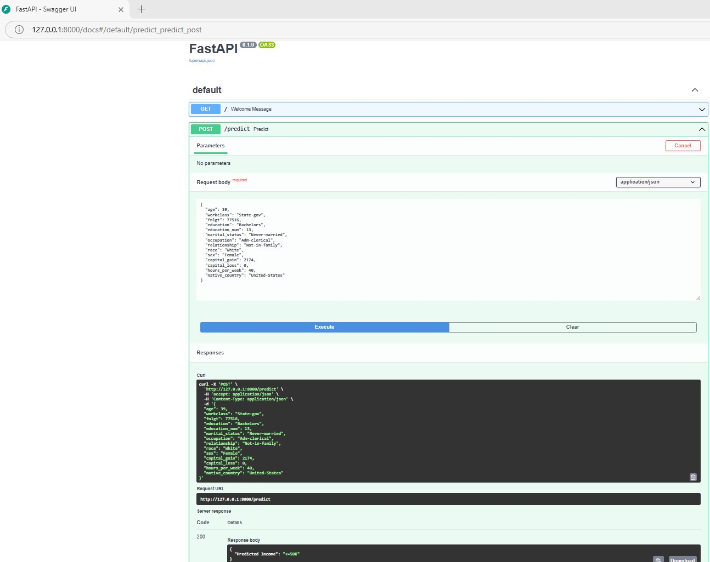
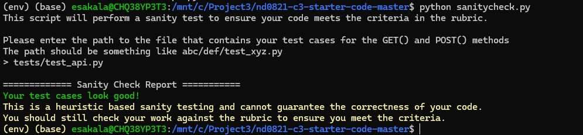

# Project Overview
This project is part of the Udacity MP DevOps nanodegree course. THe main aim is to deploy a ML Model to a cloud platform using FastAPI.

# Project Description
The project deploys a Random Forest Classifier trained using Census Income data from UC Irvine Machine Learning Repository.

# Environment Setup
THe project is developed using Windows WSL2, python 3.10. To install the necessary packages run:
```
pip install -r requirements.txt
```
## Repositories
* Create a directory for the project and initialize git.
    * As you work on the code, continually commit changes. Trained models you want to use in production must be committed to GitHub.
* Connect your local git repo to GitHub.
* Setup GitHub Actions on your repo. You can use one of the pre-made GitHub Actions if at a minimum it runs pytest and flake8 on push and requires both to pass without error.
    * Make sure you set up the GitHub Action to have the same version of Python as you used in development.

# Training the model
To train the Random Forest Classifier. Run the following code:
```
python starter/train_model.py
```

# API 
To send request to API

```
python reander_API_request.py
```

# Outputs
### Model Card
[Model card](./model_card.md)
### Slices output
[Slices output](./slice_output.txt)
### Continuous Integration

### Continuous Deployment

### FastAPI Docs

### Get Request

### Post Request

### Sanity Checks
